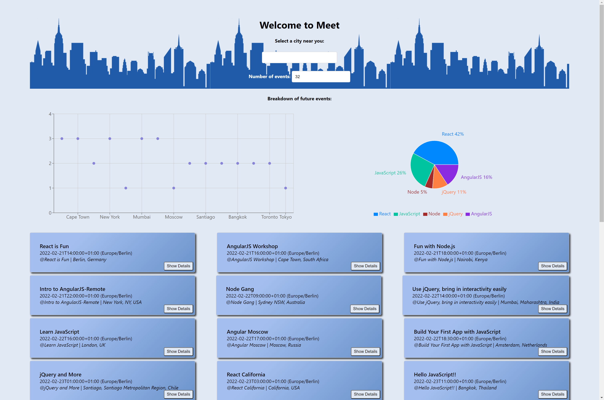
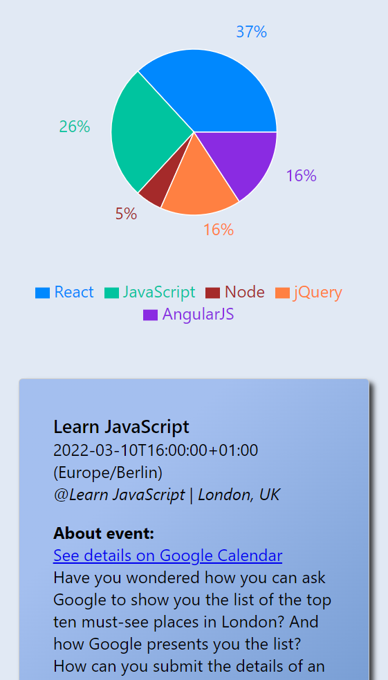

# meet_app
- Serverless, progressive web application (PWA) with React using a test-driven development (TDD) technique. The application uses the Google Calendar API to fetch upcoming events.
- Live site: https://numenot.github.io/meet_app/

# Key Features
- Filter events by city.
- Show/hide event details.
- Specify number of events.
- Use the app when offline.
- Add an app shortcut to the home screen.
- View a chart showing the number of upcoming events by city.

# User Stories
- As a user, I would like to be able to filter events by city so that I can see the list of events that
take place in that city.
- As a user, I would like to be able to show/hide event details so that I can see more/less
information about an event.
- As a user, I would like to be able to specify the number of events I want to view in the app so
that I can see more or fewer events in the events list at once.
- As a a user, I would like to be able to use the app when offline so that I can see the events I
viewed the last time I was online.
- As a user, I would like to be able to add the app shortcut to my home screen so that I can
open the app faster.
- As a user, I would like to be able to see a chart showing the upcoming events in each city so
that I know what events are organized in which city.

# Technologies used
- React
- React axios
- Google Calendar API

# Startup
- Clone project
- Install necessary dependencies in package.json
- Navigate to project folder in Command Prompt
- Run npm start
- Server should be running at http://localhost:3000

# Screenshots

## Desktop

## Mobile

